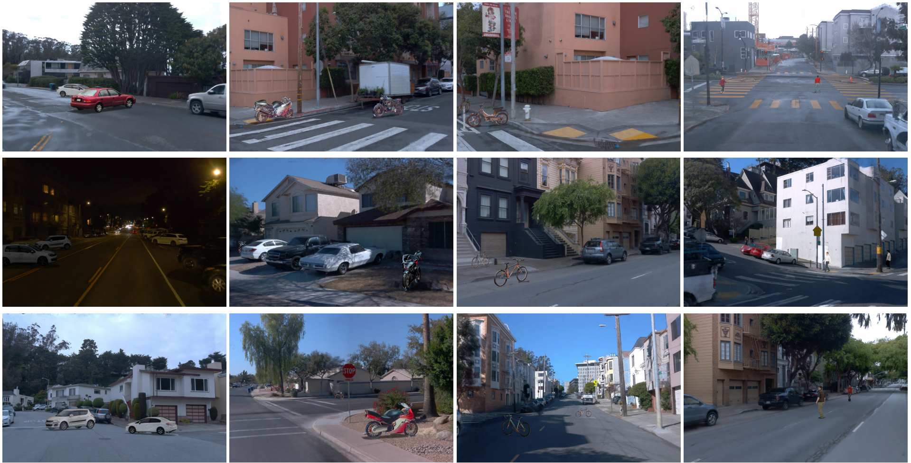

# S-NeRF: Neural Radiance Fields for Street Views
### [[Project page]](https://ziyang-xie.github.io/s-nerf/) / [ [Paper]](https://arxiv.org/abs/2303.00749) / [[Demo]](https://img.youtube.com/vi/CY4NK-bvEus/0.jpg)
> [**S-NeRF: Neural Radiance Fields for Street Views**](https://arxiv.org/abs/2303.00749),  
> [Ziyang Xie](https://ziyangxie.site/), [Junge Zhang](https://andy-zd.github.io/), Wenye Li, [Feihu Zhang](http://www.feihuzhang.com/), [Li Zhang](https://lzrobots.github.io)  
> **ICLR 2023**

### [[Project page]](https://fudan-zvg.github.io/S-NeRF/) / [[Paper]](https://arxiv.org/abs/2402.02112)
> [**S-NeRF++: Autonomous Driving Simulation via Neural Reconstruction and Generation**](https://arxiv.org/abs/2402.02112),  
> Yurui Chen, [Junge Zhang](https://andy-zd.github.io/), [Ziyang Xie](https://ziyangxie.site/),  Wenye Li, [Feihu Zhang](http://www.feihuzhang.com/), Jiachen Lu, [Li Zhang](https://lzrobots.github.io)  
> **TPAMI 2025**


We introduce S-NeRF, a robust system to synthesizing large unbounded street views for autonomous driving using Neural Radiance Fields (NeRFs). This project aims to enhance the realism and accuracy of street view synthesis and improve the robustness of NeRFs for real-world applications. (e.g. autonomous driving simulation, robotics, and augmented reality)

## 🚀 News
[8/06/24]  We released the code for [**S-NeRF++: Autonomous Driving Simulation via Neural Reconstruction and Generation**](https://arxiv.org/abs/2402.02112). A comprehensive driving simulation system based on neural reconstruction. 

- Check it out 👉🏻 [directory s-nerfpp](#🔄Introducing S-NeRF++)

## ✨ Key Features

- **Large-scale Street View Synthesis**: S-NeRF is able to synthesize large-scale street views with high fidelity and accuracy.

- **Improved Realism and Accuracy**: S-NeRF significantly improves the realism and accuracy of specular reflections and street view synthesis.

- **Robust Geometry and Reprojection**: By utilizing noisy and sparse LiDAR points, S-NeRF learns a robust geometry and reprojection based confidence to address the depth outliers.

- **Foreground Moving Vehicles**: S-NeRF extends its capabilities for reconstructing moving vehicles, a task that is impracticable for conventional NeRFs.

## 👀 Model Pipline Overview


## TODOs
- [x] Env Installation
- [x] Pose Preparation Scripts
- [x] Depth & Flow Preparation Scripts
- [x] Code for training and testing
- [x] Foreground Vehicle Reconstruction [Foreground-branch](https://github.com/fudan-zvg/S-NeRF/tree/foreground)

## 🔧 Installation
Create a conda environment:
```
conda create -n S-NeRF python=3.8 
conda activate S-NeRF
```

Install predependents:
```
pip install "git+https://github.com/facebookresearch/pytorch3d.git@stable"
```

Install the required packages:
```
pip install -r requiremnets.txt
```

### 📂 Data Preparation
1. Prepare Dataset according to the following file tree
```
s-nerf/data/
├── nuScenes/
│   ├── mini/
│   └── trainval/
└── waymo/
└── scenes/
```

2. Put scene name and its token in `scene_dict.json`
```json
{
    "scene-0916": "325cef682f064c55a255f2625c533b75",
    ...
}
```

2. Prepare the poses, images and depth in S-NeRF format
- nuScenes
```
python scripts/nuscenes_preprocess.py 
       --version [v1.0-mini / v1.0-trainval] \
       --dataroot ./data/<YOUR DATASET ROOT> \
```

- Waymo 
```
python scripts/waymo_preprocess.py
```

3. Prepare the depth data  
Put the first smaple token of the scene in `./data/depth/sample_tokens.txt`   
Then follow the [Depth Preparation Instruction](/scripts/depth_model/README.md)


### 🚀 Train S-NeRF 
```
cd s-nerf
python train.py --config [CONFIG FILE]
```

> For the foreground vehicle reconstruction, please refer to branch [foreground](https://github.com/fudan-zvg/S-NeRF/tree/foreground).

# 🔄 Introducing S-NeRF++
## 🛠️ Pipeline
<div align="center">
  
</div>

## Get started
### Environment
```shell
# Clone the repo.
git clone https://github.com/fudan-zvg/S-NeRF.git
cd S-NeRF/s-nerf++

# Make a conda environment.
conda create --name snerfpp python=3.9
conda activate snerfpp 

# Install requirements.
pip install -r requirements.txt

git clone https://github.com/NVlabs/nvdiffrast
pip install ./nvdiffrast

git clone https://github.com/ashawkey/raytracing
pip install ./raytracing

pip install torch_scatter ./zipnerf/gridencoder

# install kaolin, adapt the CUDA version to yourself, default cu117
pip install kaolin==0.15.0 -f https://nvidia-kaolin.s3.us-east-2.amazonaws.com/torch-2.0.1_cu117.html
```

#### Download our Fusion adaption model
The pretrained relighting and inpainting models can be downloaded [here](https://drive.google.com/drive/folders/127pvyKt6I-10KViVAYwTywDcXo8ngZk0). Put the `inpaint` directory in the main directory `./`

#### Download our Foreground asset bank
Some of the reconstructed or generated foreground assets can be downloaded here [here](https://drive.google.com/drive/folders/127pvyKt6I-10KViVAYwTywDcXo8ngZk0). Put the `TEXTure_ckpt` directory in the main directory `./`

### Background Training
The NeRF training and data process are to be released.  
A processed waymo scene dataset and its trained checkpoint can be downloaded [here](https://drive.google.com/drive/folders/127pvyKt6I-10KViVAYwTywDcXo8ngZk0). Put the `dataset` in the `./` and `ckpt` in `./zipnerf/`
### Simulating
You can run the following code to start simulation based on trained NeRF ckpts (background scenes) and foreground assets.
```shell
# Two cars will be randomly inserted into each scene. Simulate 10 images for each scene
python config_run.py --config configs/car.yaml --n_image 10 --gpu 0
```
You will find the simulation data in `./annotation` directory as follows:
```
annotation
└── <sequence_id>
    └── <run timestamps>
        ├── bbox
        │   └── frame_id.txt
        ├── depth
        │   └── frame_id.png
        ├── image
        │   └── frame_id.png
        │── semantic
        │   └── frame_id.png
        │── vis
        │   └── frame_id.png
        ├── bev_results.npy
        ├── intrinsic.npy
        └── target_poses.npy 
```
Our bbox format is following [kitti-format Waymo dataset](https://github.com/caizhongang/waymo_kitti_converter). The camera parameters of each frame are saved in `intrinsic.npy` and `target_poses.npy`. The semantic labels are following Cityscape 19 classes. 

## TODOs
- [x] Data preparation
- [x] Nuscenes pipeline
- [x] Foreground generation

## 🎞️ Some simulation results on Waymo
<div align="center">
  
</div><br/>

## 📝 Bibtex
If you find this work useful, please cite:
```bibtex
@inproceedings{xie2023snerf,
author = {Xie, Ziyang and Zhang, Junge and Li, Wenye and Zhang, Feihu and Zhang, Li},
title = {S-NeRF: Neural Radiance Fields for Street Views},
booktitle = {International Conference on Learning Representations (ICLR)},
year = {2023}
}
```
```bibtex
@article{chen2025snerf,
title={S-NeRF++: Autonomous Driving Simulation via Neural Reconstruction and Generation},
author={Chen, Yurui and Zhang, Junge and Xie, Ziyang and Li, Wenye and Zhang, Feihu and Lu, Jiachen and Zhang, Li},
journal={IEEE Transactions on Pattern Analysis and Machine Intelligence (TPAMI)},
year={2025}
}
```


