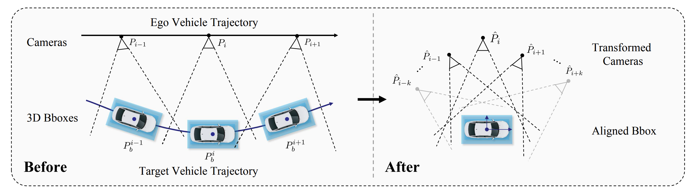

# S-NeRF: Neural Radiance Fields for Street Views
### [[Project page]](https://ziyang-xie.github.io/s-nerf/)[ [Paper]](https://arxiv.org/abs/2303.00749) 
> [**S-NeRF: Neural Radiance Fields for Street Views**](https://arxiv.org/abs/2303.00749),  
> [Ziyang Xie](https://ziyangxie.site/), [Junge Zhang](https://andy-zd.github.io/), Wenye Li, [Feihu Zhang](http://www.feihuzhang.com/), [Li Zhang](https://lzrobots.github.io)  
> **ICLR 2023**


We introduce S-NeRF, a robust system to synthesizing large unbounded street views for autonomous driving using Neural Radiance Fields (NeRFs). This project aims to enhance the realism and accuracy of street view synthesis and improve the robustness of NeRFs for real-world applications. (e.g. autonomous driving simulation, robotics, and augmented reality)

## ✨ Key Features

- **Large-scale Street View Synthesis**: S-NeRF is able to synthesize large-scale street views with high fidelity and accuracy.

- **Improved Realism and Accuracy**: S-NeRF significantly improves the realism and accuracy of specular reflections and street view synthesis.

- **Robust Geometry and Reprojection**: By utilizing noisy and sparse LiDAR points, S-NeRF learns a robust geometry and reprojection based confidence to address the depth outliers.

- **Foreground Moving Vehicles**: S-NeRF extends its capabilities for reconstructing moving vehicles, a task that is impracticable for conventional NeRFs.

## 👀 Model Pipline Overview


## 📷 Demo
[](https://www.youtube.com/embed/CY4NK-bvEus)

## TODOs
- [x] Env Installation
- [x] Pose Preparation Scripts
- [x] Depth & Flow Preparation Scripts
- [x] Code for training and testing
- [x] Foreground Vehicle Reconstruction [Foreground-branch](https://github.com/fudan-zvg/S-NeRF/tree/foreground)

## 🔧 Installation
Create a conda environment:
```
conda create -n S-NeRF python=3.8 
conda activate S-NeRF
```

Install predependents:
```
pip install "git+https://github.com/facebookresearch/pytorch3d.git@stable"
```

Install the required packages:
```
pip install -r requiremnets.txt
```

### 📂 Data Preparation
1. Prepare Dataset according to the following file tree
```
s-nerf/data/
├── nuScenes/
│   ├── mini/
│   └── trainval/
└── waymo/
└── scenes/
```

2. Put scene name and its token in `scene_dict.json`
```json
{
    "scene-0916": "325cef682f064c55a255f2625c533b75",
    ...
}
```

2. Prepare the poses, images and depth in S-NeRF format
- nuScenes
```
python scripts/nuscenes_preprocess.py 
       --version [v1.0-mini / v1.0-trainval] \
       --dataroot ./data/<YOUR DATASET ROOT> \
```

- Waymo 
```
python scripts/waymo_preprocess.py
```

3. Prepare the depth data  
Put the first smaple token of the scene in `./data/depth/sample_tokens.txt`   
Then follow the [Depth Preparation Instruction](/scripts/depth_model/README.md)


### 🚀 Train S-NeRF 
```
cd s-nerf
python train.py --config [CONFIG FILE]
```

> For the foreground vehicle reconstruction, please refer to branch [foreground](https://github.com/fudan-zvg/S-NeRF/tree/foreground).


## 📝 Bibtex
If you find this work useful, please cite:
```bibtex
@inproceedings{ziyang2023snerf,
author = {Xie, Ziyang and Zhang, Junge and Li, Wenye and Zhang, Feihu and Zhang, Li},
title = {S-NeRF: Neural Radiance Fields for Street Views},
booktitle = {International Conference on Learning Representations (ICLR)},
year = {2023}
}
```


