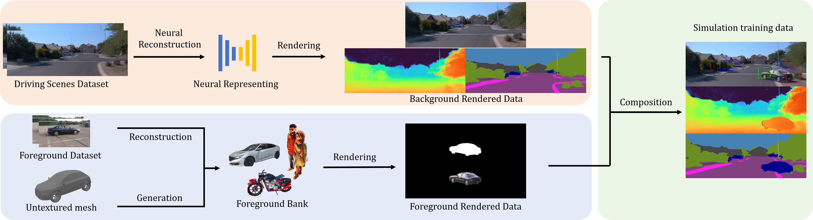
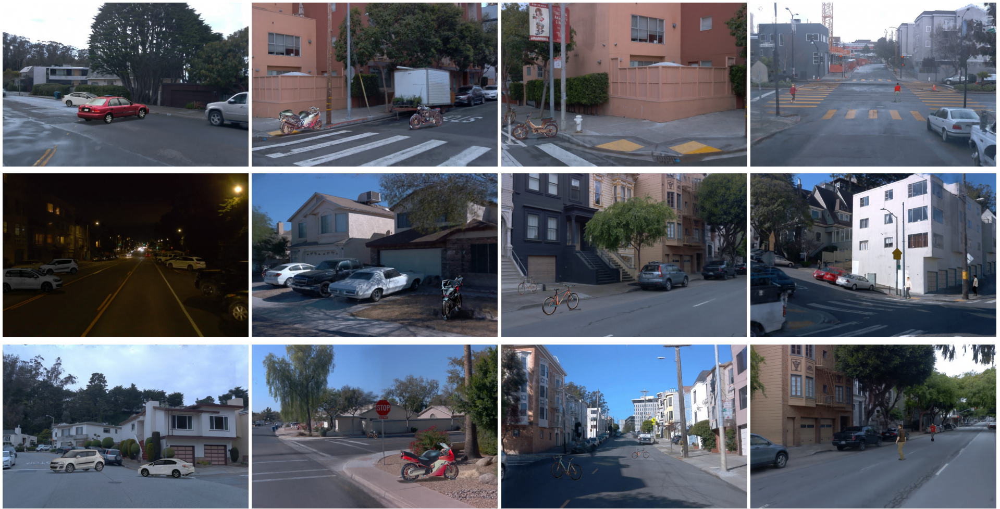

# S-NeRF++: Autonomous Driving Simulation via Neural Reconstruction and Generation
### [[Paper]](https://arxiv.org/abs/2402.02112) 

> [**S-NeRF++: Autonomous Driving Simulation via Neural Reconstruction and Generation**](https://arxiv.org/abs/2402.02112),            
> Yurui Chen, Junge Zhang, Ziyang Xie, Wenye Li, Feihu Zhang, Jiachen Lu, Li Zhang  
> **Arxiv preprint**

**Official implementation of "S-NeRF++: Autonomous Driving Simulation via Neural Reconstruction and Generation".** 


## 🛠️ Pipeline
<div align="center">
  
</div><br/>

## Get started
### Environment
```shell
# Clone the repo.
git clone https://github.com/fudan-zvg/###
cd ###

# Make a conda environment.
conda create --name snerfpp python=3.9
conda activate snerfpp

# Install requirements.
pip install -r requirements.txt

git clone https://github.com/NVlabs/nvdiffrast
pip install ./nvdiffrast

git clone https://github.com/ashawkey/raytracing
pip install ./ratracing

pip install torch_scatter ./zipnerf/gridencoder

# install kaolin, adapt the CUDA version to yourself, default cu117
pip install kaolin==0.15.0 -f https://nvidia-kaolin.s3.us-east-2.amazonaws.com/torch-2.0.1_cu117.html
```

#### Download our Fusion adaption model
The pretrained relighting and inpainting models can be downloaded [here](None). Put the `inpaint` directory in the main directory `./`

#### Download our Foreground asset bank
Some of the reconstructed or generated foreground assets can be downloaded here [here](None). Put the `TEXTure_ckpt` directory in the main directory `./`

### Background Training
The NeRF training and data process are to be released.  
A processed waymo scene dataset and its trained checkpoint can be downloaded [here](None). Put the `dataset` in the `./` and `ckpt` in `./zipnerf/`
### Simulating
You can run the following code to start simulation based on trained NeRF ckpts (background scenes) and foreground assets.
```shell
# Two cars will be randomly inserted into each scene. Simulate 10 images for each scene
python config_run.py --config config/car.yaml --n_image 10 --gpu 0
```
You will find the simulation data in `./annotation` directory as follows:
```
annotation
└── <sequence_id>
    └── <run timestamps>
        ├── bbox
        │   └── frame_id.txt
        ├── depth
        │   └── frame_id.png
        ├── image
        │   └── frame_id.png
        │── semantic
        │   └── frame_id.png
        │── vis
        │   └── frame_id.png
        ├── bev_results.npy
        ├── intrinsic.npy
        └── target_poses.npy 
```
Our bbox format is following [kitti-format Waymo dataset](https://github.com/caizhongang/waymo_kitti_converter). The camera parameters of each frame are saved in `intrinsic.npy` and `target_poses.npy`. The semantic labels are following Cityscape 19 classes. 

### 🎞️ Some simulation results on Waymo
<div align="center">
  
</div><br/>

## 📜 BibTeX
```bibtex
@article{chen2024snerf,
      title={S-NeRF++: Autonomous Driving Simulation via Neural Reconstruction and Generation}, 
      author={Yurui Chen and Junge Zhang and Ziyang Xie and Wenye Li and Feihu Zhang and Jiachen Lu and Li Zhang},
      year={2024},
}
```
